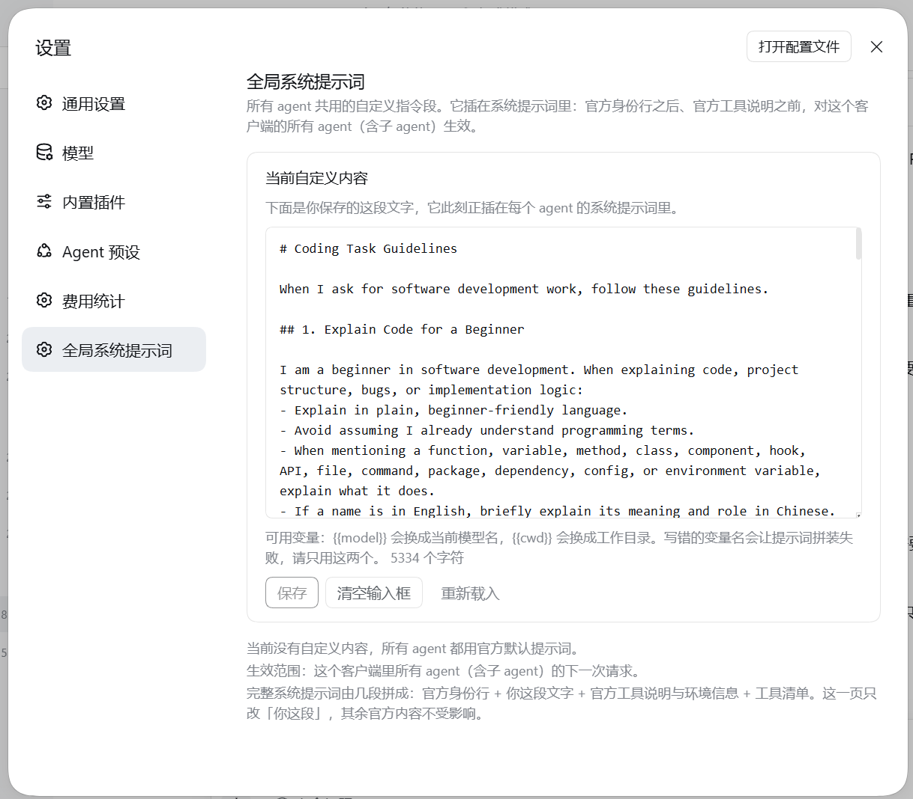

# dsh-prompt-editor

**给 DeepSeek Harness 加一页「全局系统提示词」设置，改完保存就生效。**

一个 DSH 插件：在「更多设置」里多出一页，用来查看、修改并保存**所有 agent 共用**的那段系统提示词。纯 JavaScript，没有编译步骤，不改 DSH 内核，只用官方公开的插槽与服务。



*截图取自桌面客户端：页面在「更多设置」里，紧挨「费用统计」下方——那是另一个插件 [`dsh-cost-stats`](https://github.com/AGImentu/dsh-cost-stats)，用来看每轮回复花了多少钱。页面第一行脚注会显示当前配置来自哪个文件，上图已隐去本机路径。*

---

## ❓ 它解决什么问题

每个人对 agent 的脾气都有自己的偏好：有人希望回答先给结论、再讲细节；有人希望凡是涉及代码就用大白话解释；有人希望语气干脆、少一点客套。DSH 允许你在会话里现说一遍，但**新开一个会话就得重说**，子 agent 也带不上这些偏好。

这个插件把这类偏好变成**一份全局设置**：在设置页里写一次，之后所有 agent（含子 agent、含新开的会话）都会自动带上，不用再逐个交代。也就是说，它要解决的是「我想让 agent 一直用某种态度、某种风格回复我」这件事——统一设置，而不是每个会话单独设。

想给所有 agent 加一段固定指令，最直觉的做法是去改 `dsh-system-prompt` 这一行的 `personaPrefix`。**但那样改不会生效，而且不报任何错**：

- 官方默认的 Agent 预设（`dsh-web-app/presets/cordis.patch.yml`）会为每个 agent 挂一行 `@deepseek-ai/dsh-persona`，而它注册的段落名和部署级人设**同名**；
- `dsh-persona` 的语义是「作用域内的段落**遮蔽**部署级默认值」，而不是排在它旁边。

于是你写的文字只存在于配置文件里：用配置读取接口能看到，模型却永远收不到。

本插件的做法是注册**自己名字**的段落（`prompt-editor:global-instructions`，order 10）。名字独一无二，任何预设都遮蔽不了它，所以它对所有 agent（含子 agent）都生效。插入位置在官方身份行与人设前缀之后、第一方工具说明之前。

## ✨ 功能

- **打开即显示**当前保存的那段文字（读的是当前 profile 的真实配置）
- **保存即生效**：写入当前 profile 的 `cordis.patch.yml`，由 Loader 立即重组，**下一轮对话就用上新提示词**，不需要重启客户端
- **清空 = 取消自定义**：把输入框清空再保存，配置里的覆盖项会被移除
- 只用 `--dsw-alias-*` 主题变量，跟随客户端的明暗主题与字号设置
- 支持中英文界面文案

## 📦 安装

前置：DSH 能正常运行（Electron 桌面客户端或 `dsh web`）。

**方式一：插件管理器（推荐）**

侧栏「插件」→「添加插件」→ 粘贴本仓库的本地绝对路径（例如 `D:\Desktop\dsh-prompt-editor`）→ 安装。管理器会自动完成 pnpm 链接、把本包加入 `dsh.profile.bundles`，并通过 HMR 立即激活。

**方式二：CLI**

```bash
dsh plugin --profile <profile> add github:AGImentu/dsh-prompt-editor
```

> 注意：Electron 桌面客户端的 profile 由应用独占管理，CLI 会拒绝操作（`profile "desktop" is managed exclusively by the Electron application`）。桌面版请用方式一。

**方式三：手动 link**（CLI 不可用时）

```bash
# 在 $DSH_HOME/profiles/<profile> 目录里执行
pnpm add "link:<本仓库的绝对路径>"
```

然后把 `dsh-prompt-editor` 加进同一个 `package.json` 的 `dsh.profile.bundles` 数组。

安装后重启客户端（或让它自己 HMR 重组），页面就在「更多设置」里。

## 🗂 文件结构

| 文件 | 职责 |
|---|---|
| [`index.js`](index.js) | 宿主半边（Node 侧）：把保存的文字注册成系统提示词段落，并提供读写配置的 HTTP 路由 |
| [`client.js`](client.js) | 浏览器半边：注册 `settings.section` 插槽里的设置页（React，无 JSX 构建步骤） |
| [`cordis.patch.yml`](cordis.patch.yml) | 组合包补丁：向 profile 组合里插入本插件的宿主行 |
| [`package.json`](package.json) | 清单：`dsh.bundle.patch`（补丁位置）与 `dsh.client`（浏览器半边位置） |

## 🔧 它是怎么工作的

**宿主半边**（`index.js`）挂两样东西：

| 步骤 | 用的官方接口 | 说明 |
|---|---|---|
| 注册提示词段落 | `ctx.systemPrompt.section({ name, order, text })` | 段落名唯一，不会被 Agent 预设遮蔽 |
| 提供读写路由 | `ctx.webServer.register({ kind: 'exact', path, handler })` | `GET /prompt-editor/prompt` 读，`POST` 写 |
| 配置落盘 | `ctx.configEditor.edit()` | 官方服务：写入前校验、原子替换、保留文件注释、写完立即重组；被更高层覆盖时**明确拒绝**而不是写进一个不生效的文件 |

**浏览器半边**（`client.js`）只做一件事：往 `settings.section` 这个列表插槽注册一页，`order` 取 310，落在官方设置页与其它插件页之间。

## ⚠️ 已知限制

- **宿主代码改动需要重启客户端**：Node 侧的模块不参与热更；只改 `client.js` 的话刷新页面即可。
- **路由没有额外的 cookie 校验**：和其它本地插件路由一样只监听本机，但本机其它程序理论上也能调用它改写提示词。
- **只写当前 profile**：`dsh web` 与桌面客户端是不同的 profile，两边要各配一次。
- **`{{...}}` 是渲染期变量**：`{{model}}`、`{{cwd}}` 由框架保证存在；写错的变量名会让提示词组装失败（DSH 会明确报错，不会静默降级）。

## 🧪 开发

纯 JavaScript ESM，**没有构建步骤**：`lib/` 不存在，源代码就是运行代码。

```bash
node --check index.js     # 宿主半边语法
node --check client.js    # 浏览器半边语法
```

调试入口：设置页 → 打开配置文件的路径；配置就写在当前 profile 的 `cordis.patch.yml` 里，形如

```yaml
- id: prompt-editor
  name: "dsh-prompt-editor"
  config:
    text: |-
      ...你的提示词...
```

## License

[MIT](LICENSE)
